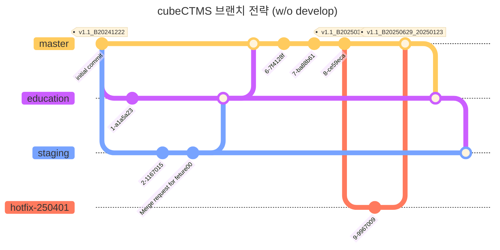

# memo
## ::branch 원칙
- master 의 변경사항은 education 에 모두 반영되어야 한다.
- education 의 변경사항은 staging 에 모두 반영되어야 한다.
- staging 의 변경사항은 develop 에 모두 반영되어야 한다
### 변경사항 확인 방법
> `git log A..B --oneline`

![[Pasted image 20250313173219.png]] ![[Pasted image 20250313173224.png]]

## ::브랜치 관리 (git-flow)
### git-flow 다이어그램

- 'Edu 서버 배포 / Real 서버 미배포' 기간의 테스트 및 배포 절차
	- 1) STG 서버엔 항상 정기이관 변경건과 비정기이관 변경건이 함께 배포되어있어야 한다.
	- 2) 비정기 변경건은 master 브랜치부터 staging 브랜치 까지 Top-down 으로 merge 되어야 한다.
	- -> **비정기 변경건을 staging 브랜치까지 모두 반영 후, staging 브랜치를 STG 서버에 배포하여 Test 한다. Test 가 통과하면 Edu 서버와 Real 서버를 차례대로 배포한다.**

### develop 브랜치에 관하여
develop 브랜치엔 **Dev 서버에 제약없이 배포**할 수 있도록 파이프라인을 연결하였습니다. **신규 기능 및 설정의 PoC 를 주로 수행**하게 됩니다. 
(QA TC 는 Dev 서버에서 수행하면 안됩니다. TC 수행을 위해선 stgaing 에 머지 하여 Staging beta / real 서버에 배포해주세요.)

develop 브랜치엔 팀장/그룹장 리뷰 없이 merge 가 가능하여 개발자 스스로 Dev 배포가 가능하지만, **develop 브랜치에 merge할 때에도 Merge request (MR)** 흐름을 따라주시길 바랍니다.
CLI 를 통해 직접 revert 하는 것도 힘들 뿐 더러, 로컬에서 병합 후 리모트에 푸시 하는 것 보다 MR 을 통해 merge 이력을 남기는 것이 관리가 쉽습니다.
#### DB 스키마 변경 / PLSQL 변경 반영
DB 스키마 변경, PLSQL 스크립트 변경, 데이터 마이그레이션 등의 데이터베이스 관련 변경 건은 develop 머지 여부와 관련 없이 Dev DB 공간에 반영해야 합니다.
DB 변경 이력은 개발자가 직접 프로젝트 파일로 남기기 때문에 추적이 어렵고, CTMS 의 경우 CDMS 와 같은 DB 공간을 사용하므로 스키마 등 DB 오브젝트를 STG 에서 내려받는 것이 어렵습니다.
(\* 현재 Dev real 공간의 스키마가 다수 깨져있어 사용이 어려운 점 참고)

### 이관 태그 규칙
- 정기 이관 : `${수정버전.replace(' ', '_')}`
    - i.e. v1.1_B20241222
- 비정기 이관 : `${수정버전.replace(' ', '_')}_${비정기 날짜.format('YYYYMMDD')}`
    - i.e. v1.1_B20241222_20241231

### 특이사항::머지 자동화 (staging -> develop)
- Access token : 개인: `gitcube-dr-xBjhyjX1-pzccV2BT` 
	- WEBAPP: `gitcube-ZswxDAdX7dmd7dBsuKvp`
	- API: `gitcube-2iYsRWf4aQ5N84R1gd6X`
	- BATCH: `gitcube-XMDqsG3PSm89BEhHu_M8`
- ![[Pasted image 20250114170815.png]]

## ::CI/CD 파이프라인 구성
- Dev 서버: 개발자 테스트 공간 (AWS 등 CSP 설정 적용 테스트, EFS 사용기능 테스트)
- Stg 서버: QA 테스트 공간 (TC 등)
- Edu 서버: 교육 공간
- Prod 서버: 실제 서비스
### WEBAPP

### API / BATCH

### Auto-merge
gitlab-ci Job 에 CLI 를 통한 머지 자동화 Job 이 설정되어있습니다 (`staging` -> `develop`). `staging` 의 변경사항은 `develop` 에 항상 반영되어있어야 합니다.

`manual` Job 이므로 개발자가 직접 action 해야합니다. Merge conflict 가 발생하면 `develop` 에서 해소해주세요.

Auto merge 를 위한 Access token 은 각 리포지토리의 Setting > CI/CD > Variables > `AUTOMERGE_TOKEN` 에서 관리합니다.
신규 Access token 이 필요한 경우, Setting > Access tokens > Project access tokens 에서 생성해주세요 (개인 Access token 사용 x).

# references
- [Confluence > cubeCTMS 브랜치 관리 가이드](https://crscube.atlassian.net/wiki/spaces/TEAM3/pages/4061724842/cubeCTMS)
# connections
- [[PM6597 서버별 파이프라인 분리]]
- [[cubeCTMS 배포 태그 및 gitlab 릴리즈 관리]][[]]